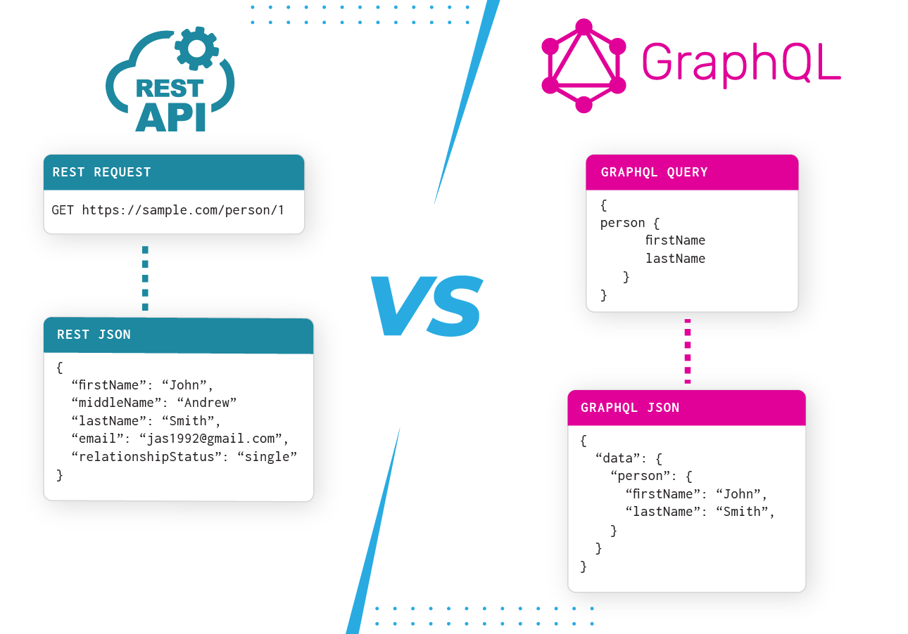

# apollo-server

## GRAPHQL
   GraphQL is usually described as a frontend-directed API technology as it allows front-end developers to request data in a much simpler way than ever before. Introduced by Facebook, the objective of this query language is to formulate client applications formed on instinctive and adjustable format, for portraying their data prerequisites as well as interactions. The best part is the language isn’t dependent on any specific database management system and is actually supported by your current data and coding.

        One of the basic problems with conventional REST is running and controlling multiple endpoints is another difficulty as clients are mostly needed to request data from diversified endpoints.

   While establishing a GraphQL server, it’s only important to have single URL for complete data procurement and alteration. Therefore, a user can request a dataset from a server by transferring a query string, mentioning what they need.

## Difference Between GraphQl and REST

   

   GraphQL is much different than a standard REST API where you typically have a specific endpoint or resourse we are hitting that determines an entire block of data that comes back in the returning JSON response, which then needed to be parsed and scattered.

GraphQL is instead established around schema, queries, and resolvers and rather aims to improve upon the REST philosophy by allowing you to ask for a specific piece of data -- not just the entire block. No need for parsing through a long stream of data -- you only get what you ask for. And what you ask for could be compiled from several different REST APIs.

GraphQL and REST are two different things -- GraphQL is a language and a technology, while REST is an architecture pattern, which means that even as teams increasingly adopt GraphQL, it does not mean the end of the road for REST.

In fact, if you haven’t run in into any issues with REST, GraphQL may be of no use to you at all. In this way, GraphQL has been valuable for teams who have been limited by traditional REST APIs, which often arises with apps that have a complex UI/UX and typically require multiple endpoints.

  

## Schema And Resolver

# RESOLVER

  Apollo Server needs to know how to populate data for every field in your schema so that it can respond to requests for that data. To accomplish this, it uses resolvers.

     A resolver is a function that's responsible for populating the data for a single field in your schema. It can populate that data in any way you define, such as by fetching data from a back-end database or a third-party API.

# SCHEMA
   The GraphQL schema is at the center of every GraphQL server. It defines the server's API, allowing clients to know which operations can be performed by the server. The schema is written using the GraphQL schema language (also called schema definition language, SDL). With it, you can define object types and fields to represent data that can be retrieved from the API as well as root types that define the group of operations that the API allows.

The root types are the query type, mutation type, and subscription type, which are the three types of operations you can run request from a GraphQL server. The query type is compulsory for any GraphQL schema, while the other two are optional. While we can define custom types in the schema, the GraphQL specification also defines a set of built-in scalar types. They are Int, Float, Boolean, String, and ID.

